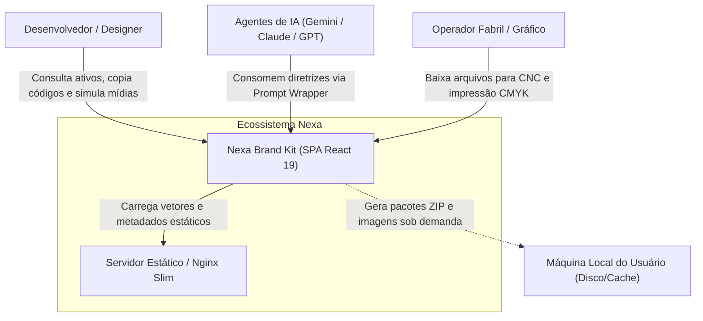

# 02. Contexto do Sistema (C4 L1)

## 1. Descrição do Ecossistema
O Nexa Brand Kit opera como uma Aplicação de Página Única (SPA) servida através de containers Nginx de alta performance, sem dependência de persistência transacional em bancos de dados relacionais. Toda manipulação de ativos é executada em tempo de execução no cliente.

## 2. Diagrama de Contexto (C4 L1)

## 3. Atores do Sistema
* **Desenvolvedores Frontend:** Consomem caminhos relativos de SVGs, classes do Tailwind CSS v4 e tags HTML prontas.
* **Designers e Profissionais de Marketing:** Simulam campanhas em tempo real (Mockups) e exportam ativos com densidade de pixels específica (FHD, 4K, 8K).
* **Parceiros Industriais (CNC / Impressão):** Acessam versões planas monocromáticas (/cnc) e com canal CMYK calibrado (/print) para maquinário de corte e rotogravura.
* **Modelos de Linguagem e Agentes Autônomos:** Consomem o documento `identidade_visual_nexa.md` para garantir zero alucinação visual em códigos gerados.\n