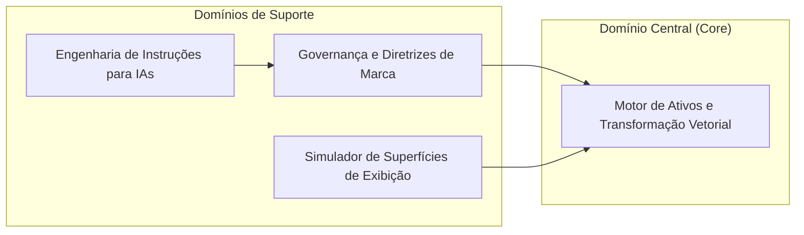

# 03. Arquitetura de Domínios

## 1. Decomposição de Domínio
O sistema organiza suas responsabilidades de negócio em quatro subdomínios principais:

## 2. Subdomínios e Responsabilidades
* **Motor de Ativos e Transformação Vetorial (Core):** Responsável pela leitura assíncrona do DOM vetorial, parsing do `viewBox`, redimensionamento proporcional sem distorção com proteção de clipping (mínimo de 16px) e renderização matricial via Canvas 2D.
* **Governança e Diretrizes de Marca (Suporte):** Centraliza as paletas de cores (Degradê Primário Neon vs Degradê Secundário Tech), tokens tipográficos e regras de integridade (Do's & Don'ts).
* **Simulador de Superfícies (Suporte):** Permite validação contextual de contraste e margens de respiro em mockups funcionais para mídias sociais e crachás físicos.
* **Engenharia de Instruções Cognitivas (Suporte):** Empacotamento de diretrizes técnicas em prompts consumíveis por IAs generativas de código e imagem.\n