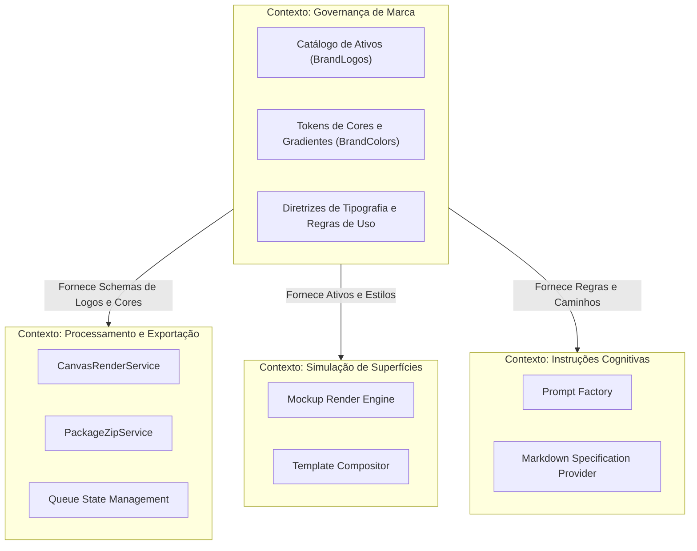

# 05. Contextos Delimitados (Bounded Contexts)

## 1. Delimitação de Fronteiras

## 2. Contratos de Fronteira
* **Ativo Vetorial (`LogoAsset`):** Entidade fundamental imutável compartilhada entre Governança, Renderização e Sandbox.
* **Item de Fila (`QueueItem`):** Modelo de transporte de comando para o contexto de exportação em lote.\n