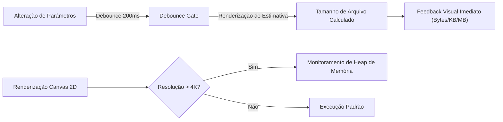

# 14. Observabilidade e Telemetria

## 1. Gestão de Performance Client-Side
Por ser uma aplicação de processamento local, a observabilidade é focada em métricas de tempo de resposta da interface e consumo de memória:

## 2. Profiling de Desempenho e Gargalos
* **Debounce de 200ms na Pré-visualização:** Impede que a digitação contínua no slider de tamanho execute dezenas de operações síncronas de desenho no Canvas 2D, mantendo o Thread Principal a 60 FPS.
* **Monitoramento de Canvas Size Limit:** O motor respeita os limites de renderização dos motores gráficos (ex: Safari iOS limita canvas a 16.777.216 pixels de área total).\n