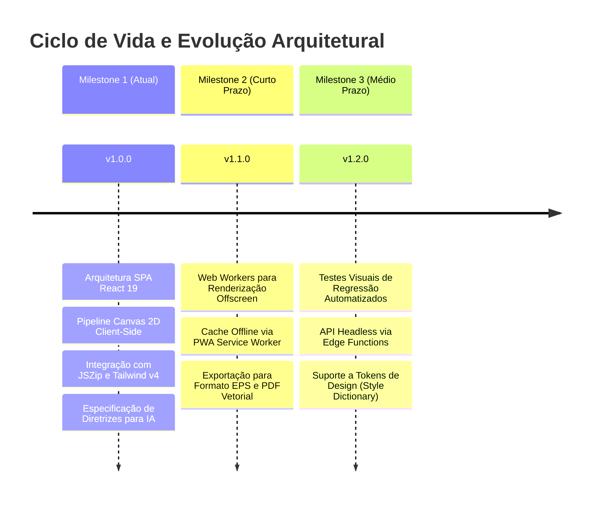

# 16. Roadmap e Evolução Arquitetural

## 1. Linha do Tempo e Marcos Arquiteturais

## 2. Próximas Refatorações Estruturais
* **OffscreenCanvas + Web Workers:** Migrar a execução do `CanvasRenderService` para segundo plano (Background Worker), garantindo thread principal totalmente desimpedida mesmo durante a geração de arquivos 8K em lote.
* **Geração de Tokens JSON / CSS Variables:** Disponibilizar endpoint e exportação de tokens de cor e tipografia em formato padrão W3C Design Tokens Community Group (DTCG).\n