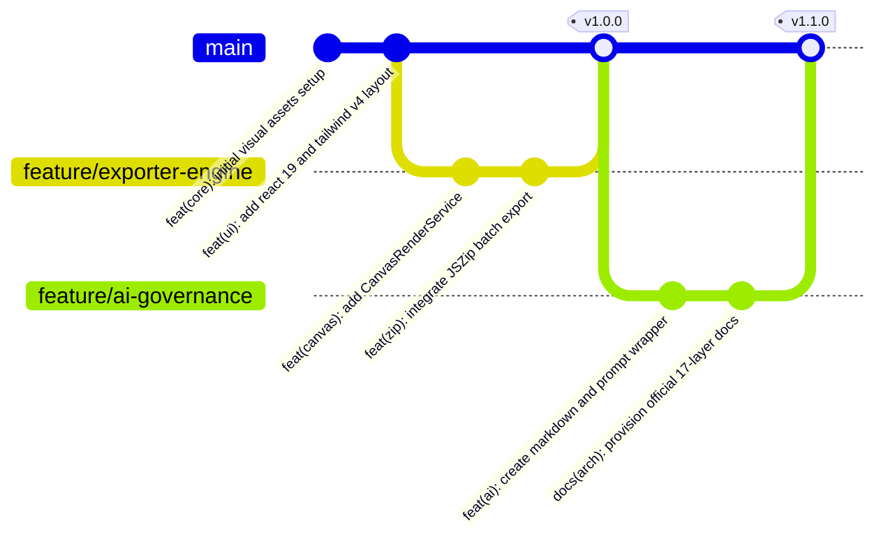

# 17. Tech & Developer Profile / Skills

Este documento sintetiza para recrutadores, tech leads, parceiros e avaliadores técnicos as competências de engenharia, hard skills, soft skills e práticas de versionamento materializadas na construção do **Nexa Brand Kit**.

## 1. Stack & Frameworks (Hard Skills)
* **Linguagens & Tipagem Estrita:** TypeScript 5.8.2 configurado com regras rígidas de compilação (`target: ES2022`, `isolatedModules`, `moduleResolution: bundler`, `noEmit: true`), garantindo total segurança de tipos sem casting inseguro.
* **Biblioteca Principal de Interface:** React 19.0.1 explorando arquitetura de componentes funcionais, gerenciamento moderno de estado (`useState`, `useEffect`), composição atômica e renderização eficiente do Virtual DOM.
* **Estilização de Última Geração:** Tailwind CSS 4.1.14 integrado via `@tailwindcss/vite`, operando com a nova engine sem arquivo `tailwind.config.js` legado, configurando tokens de marca diretamente via `@theme` (`--font-display`, `--font-sans`, `--font-mono`).
* **Animações e Micro-Interações:** Motion 12.23.24 (nova geração do Framer Motion) para animações baseadas em física e transições fluidas de cards e seções com zero engasgo de layout.
* **Motor de Build & Bundler:** Vite 6.2.3 configurado com Hot Module Replacement otimizado, suporte a deploy em subcaminhos de CDN (`base: '/nexa-web-brand-kit/'`) e scripts de sincronização de assets no ciclo de build.
* **Engenharia de Mídia & Compressão:** JSZip 3.10.1 para criação client-side de arquivos compactados e orquestração de APIs nativas de browser (HTML5 Canvas 2D Context, `DOMParser`, `XMLSerializer`, Blobs e Data-URIs).
* **Containerização & Servidor Web:** Docker multi-stage build (Node 22 Alpine como construtor de artefatos e Nginx 1.27 Alpine Slim como servidor estático de produção) orquestrado via `docker-compose.yml` para ambientes de desenvolvimento e produção.

## 2. Conceitos & Paradigmas de Desenvolvimento
* **Single Source of Truth (SSOT):** Centralização estrita de constantes de marca (`brandColors.ts`, `brandLogos.ts`, `aiInstructions.ts`), impedindo duplicação de códigos hexadecimais ou caminhos de arquivos na interface.
* **Clean Architecture no Frontend:** Clara segregação entre componentes de apresentação pura (`components/sections/`), componentes atômicos (`components/logos/`), serviços de processamento (`services/`) e contratos de dados (`types/`).
* **Processamento 100% Client-Side (Zero Backend Footprint):** Toda a pipeline de conversão de imagens, cálculo de proporção, injeção de cor e geração de pacotes ZIP roda diretamente no hardware do cliente, eliminando custos de infraestrutura de renderização em nuvem.
* **Programação Defensiva & Resiliência Gráfica:**
  * Implementação de algoritmo de redimensionamento proporcional com clamp de segurança de 16px para prevenir o colapso e invisibilidade de logotipos com proporções desiguais.
  * Clamping de entrada numérica contra exaustão de memória gráfica (Canvas Buffer Overflow).
  * Debounce de 200ms em cálculos computacionalmente caros para proteção de threads de renderização da interface.
* **Segurança e Manipulação DOM:** Sanitização do ciclo de vida de imagens com `crossOrigin = 'anonymous'` para evitar contaminação de canvas (*tainted canvas*) e revogação imediata de URLs de objeto (`URL.revokeObjectURL`) para prevenção de Memory Leaks.

## 3. Versionamento, Git Tags & Workflow
* **Padrão de Commits Semânticos (Conventional Commits):** Histórico de alterações estruturado por escopos claros (`feat(exporter):`, `fix(canvas):`, `docs(architecture):`, `refactor(tokens):`).
* **Estratégia de Releases & Git Tags (SemVer):** Uso estrito de Versionamento Semântico para marcação de releases de marca:
  * `v1.0.0` — Release base da identidade visual, exportador dinâmico e simulador de mockups.
  * `v1.1.0` — Implementação da suíte de documentação viva e isolamento de contratos para integração com IA.
* **Fluxo de Trabalho Git (Feature Branch Workflow):** Isolamento de desenvolvimentos por branches temáticas, validação prévia de tipagem estrita com `npm run lint` (`tsc --noEmit`) e revisões estruturadas via Pull Requests.

## 4. Soft Skills & Capacidades de Engenharia Demonstradas
* **Visão Holística de Produto & Sistema:** Capacidade de enxergar uma plataforma de design não apenas como uma página estática, mas como uma ferramenta de governança ativa e motor de processamento gráfico para múltiplos públicos.
* **Pensamento Crítico sobre Trade-offs:** Escolha de processamento no cliente (Canvas 2D + JSZip) em detrimento de uma API pesada em Node/Sharp, viabilizando escalabilidade infinita a custo zero de servidor.
* **Foco em Excelência e Acessibilidade Visual:** Garantia de alto contraste visual (Dark Mode vs Light Mode), preservação de margens de respiro e preocupação com usabilidade do desenvolvedor final através de atalhos de cópia rápida.
* **Prontidão para o Futuro (AI Literacy):** Antecipação da tendência onde agentes autônomos e LLMs consomem ativamente documentação técnica de marca, projetando metadados e wrappers para maximizar a assertividade dos prompts.
* **Organização e Documentação de Nível Empresarial:** Domínio pleno de Documentation as Code, estruturando um repositório preparado para sobreviver e manter consistência arquitetural por mais de 10 anos.\n